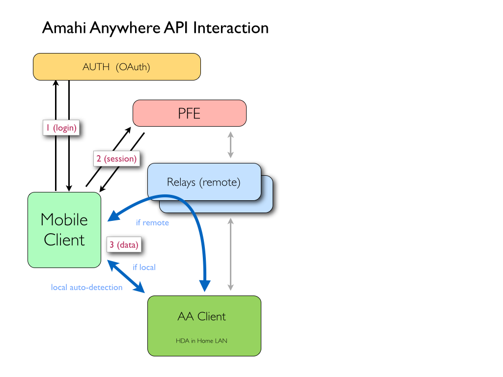

Amahi Anywhere Client API Specification - v0.13
===============================================

The Amahi Anywhere Clients use a REST HTTP protocol for browsing, downloading and streaming files and more.

The clients can be in local mode (known as "LAN" or "LAN Access" to the user), or remote mode (known as "Remote"). Internally we just call them local or remote. The client can perform streaming and the rest of the functions much faster when using the local mode, being inside the user's LAN, so that should be the favored mode, when available. The client should test for local mode availability dynamically, but only when the user is interacting with the app, *never* in the background, as this will be costly in terms of battery.

## API Endpoints
----------------

Through this document we will have the following API endpoints. The interaction with the endpoint calls is always REST-based and in JSON, unless otherwise specified.

1) The **Auth API** endpoint: `api.example.com` *with* SSL, verified certs and port 443
2) The **PFE API** endpoint (or proxy-front-end) endpoint: `pfe.example.com` *with* SSL, verified certs and port 443
3) The **Relay API** endpoint is determined by the mode of operation of the client and the info in the `PUT /client` call to the PFE:
 * in remote mode, it's the `relay_addr` parameter, **always using** SSL, **with** verified certs
 * in local mode, it's the `local_addr` parameter, using plain HTTP, *without* SSL



Example of a typical sequence of accesses:

1) Authenticate the amahi user against the Amahi API endpoint
2) GET /servers (this gives a session token to use for each server)
3) POST /auth expects JSON type data with pin key in request body and returns auth token for that hda user
4) GET /shares will return the visible shares on a given server (with the session for that server)
5) GET /files?s=SomeShare&p=/som/path/or/file.png to get a directory or a file from a server (with the proper session key)

The user navigates through their files by repeating calls like 5 above with different share names and paths.

## Authentication
-----------------

The app must collect 1) a username/email and 2) a password, from the user and authenticate this information against Amahi's servers using the [OAuth 2 protocol](http://oauth.net/) with the *Amahi API* endpoint.

In order for this to work, the app must request a pair of (string) settings from the Amahi team: 1) the App ID and 2) the App Secret. There will be two such pairs of settings, one pair for development/testing and one pair for production/release.

The OAuth API endpoint base path for production is `/api2`.

We use the simplified version of OAuth without web redirection.

To login, the client app has to first issue a `POST` to `/api2/oauth/token` with a body containing the following in it (with the items in capital letters appropriately setup):

```
grant_type=password
client_id=APP_ID
client_secret=SECRET
password=PASSWORD
username=USERNAME
```

This `POST` operation will return a JSON structure in the following form:

```json
{
    "access_token": "d78abb0542736865f94704521609c230dac03a2f369d043ac212d6933b91410e",
    "scope": "public",
    "token_type": "bearer"
}
```

Subsequent calls to the main auth server will have to have the `acces_token` returned by the OAuth call, like this:

```
GET /api2/servers?access_token=d78abb0542736865f94704521609c230dac03a2f369d043ac212d6933b91410e
```

## Initial request for Amahi servers
------------------------------------

After authenticating in the user, the client should log the user in. Then it needs to request the Amahi API back-end what servers the user has, also using the *Amahi API* endpoint. The format of the call is:

* `GET /servers`
 * The API back-end returns an array of servers that the user has installed
 * The server has a `name`, which is what is shown to the user
 * The servers may be `active` (1) or not (0). If active, the user can select it and proceed to browse it. If not, the user must not be given the chance to select it (it should be "greyed out" or some such indication)
 * Each server returns a `session` token. This is an ephimeral session value and it's *required for every subsequent call to the rest of the APIs* in the `Session` header. It may be invalidated after some time without accessing it
 * Each server also has an `ip_address`, which is either an IP proper or black if the server is not running yet
 * Each server has a `fqdn`, which is a FQDN with the Dynamic DNS name of the server

 * Example:

      ```json
		[
			{
				"name": "server1",
				"active": 1,
				"session": "6337fc16d9b31049e3137bb8fc74b86e6b4cb35c",
				"ip_addr": "1.2.3.4",
				"fqdn": "server1.yourhda.com"
			},
			{
				"name": "server2",
				"active": 0,
				"session": "",
				"ip_addr": "",
				"fqdn": ""
			}
		]
      ```

## Identifying the client to API endpoints
------------------------------------------

For all calls, the client must include a `User-Agent` header with its details so that we can support version-specific work-arounds. Here's what's typical for a user agent:

    User-Agent: AmahiAnywhere/<version> (<platform>)

where version is the version of the client and platform contains details of the platform the client is running on.

Examples:

    User-Agent: AmahiAnywhere/1.3 (iPad; iOS 7.0.4; Scale/2.00)
    User-Agent: AmahiAnywhere/1.0 (Android 4.2.2)

Failure to send this header will result in a `400 Bad Request` error. We plan to enforce these

## Resources on a server
------------------------

### Timestamps

We have adopted the format of the various time fields (e.g. the `mtime` element) to be like RFC1123 but hard-coding GMT as the time zone. For example: `Tue, 07 May 2013 05:28:09 GMT`, `Sat, 17 Aug 2013 02:38:32 GMT`.

If apps ever display the timestamp, they should use either relative terms ("4 months ago", "5 minutes ago", "about a year ago") or compensate for the client's current time zone, relative to GMT: someone in GMT+1 should see the same time in the element, plus one hour (using time arithmetic).

### Initial Client Connection

When the client connects to the PFE, the client issues a PUT /client request.  The proxy will return info about how to connect to a given server (HDA).

The client will have two operating modes (prefrably automaticly detected), **local mode** (when in the local LAN to the HDA) and **remote mode** (when not in the local LAN to the HDA and all access is done via the proxy). Any subsequent requests must be done to either of these two endpoints. Their addresses are obtained by this initial client call to the PFE.

* `PUT /client`
 * Proxy returns the Amahi Anywhere client version, local address/port and the proxy address/port the HDA is connected to.
 * The local and proxy addresses are an url, including a colon and a port number
 * Access to the local server is done via plain HTTP, regarless of the port
 * Access to the relay server **must always be via a secure TLS/HTTPS** connection, regarless of the port. Checking the certificate is **required**

 * Example:

      ```json
          {"version": "1.0", "local_addr": "http://192.168.1.10:4653", "relay_addr": "https://123.456.78.900:443"}
      ```

From this point on, the calls below can be done to the local_addr or the relay_addr.

If the client is in local mode, the API endpoint is the address given by `local_addr`. This should be the preferred mode if it's available.

If the client is in remote mode, the API endpoint is the address given by `relay_addr`.

### HDA User Authentication

Since different users can have different access permissions on HDA so each user must identify himself/herself to the HDA. In order to do that the app must request a PIN from the user. This PIN can be sent to the HDA either directly or via Proxy.

To authenticate, the client app has to issue a `POST` to `/auth` with an `application/json` content-type body containing the following in it:

* `POST /auth`
    ```json
      {
        "pin": "1234"
      }
    ```
  * The PIN must be 3 to 5 characters and must match `[A-Za-z0-9]+`.

* On successful authentication, a `200 OK` response will be sent by the server.
    ```json
      {
        "auth_token": "51e3088a2da8f1c8b9285f0fae25b95c"
      }
    ```
  * This auth_token must be sent in `Authorization` header for `/shares`, `/files` and `/logout` requests.
* On unsuccessful authentication, server will respond with `401 Unauthorized`. 

### HDA User Logout

* `POST /logout`
* Logs out the user whose auth_token has been provided and removes its session
* It will return a `200 OK` response on successful logout

#### Headers
* **Authorization** the `auth_token` must be sent here.

### Shares

* `GET /shares`
 * Lists all the shares on the HDA that are available to the logged-in user
 * The return type is a json array with a list of shares, sorted alphabetically (without capitalization), with their name as a string in the `name` element, their modification time in the `mtime` element and `tags`.
 * The `tags` field is a json list of tags associated to a share. The user can put arbitrary information in these fields.
 * The `writable` field denotes if that share is writable or not for the logged-in user. Client app must appropriately display/hide the Upload or Delete button as per the value of writable field for a given share.  
 * Example:

      ```json
      [
          { "name": "Books", "mtime": "Sat, 17 Aug 2013 02:38:32 GMT", "tags": [ "books" ], "writable": false },
          { "name": "Docs", "mtime": "Sat, 17 Aug 2013 02:38:32 GMT", "tags": [ ], "writable": true },
          { "name": "Movies", "mtime": "Sat, 17 Aug 2013 02:38:32 GMT", "tags": [ "movies" ], "writable": false },
          { "name": "Pictures", "mtime": "Sat, 17 Aug 2013 02:38:32 GMT", "tags": [ "pictures" ], "writable": false },
          { "name": "Torrents", "mtime": "Sat, 17 Aug 2013 02:38:32 GMT", "tags": [ "movies", "tv" ], "writable": false }
          { "name": "TV", "mtime": "Sat, 17 Aug 2013 02:38:32 GMT", "tags": [ "tv" ], "writable": true }
      ]
      ```

### Reading Files

* `GET /files?s=:sharename&p=:path`
 * Retrieves the file or the directory in the given share `:sharename` in the `s` parameter, with the given path `:path` in the `p` parameter
 * If the requested file is a directory, this call returns its contents as an array of entries.
  * The `name` element represents the name of the file or directory
  * The `mime_type` element represents the expected [MIME type](https://en.wikipedia.org/wiki/Internet_media_type) of the file based on the extension (the actual file could have some other data inside it)
  * The `mtime` element is the modification time of the entry
  * The `size` element contains the size of the file at the time of retrieval of the directory in bytes. It is a very large unsigned integer (uint64)
  * If the entry the case of a directory entry, the `mime_type` is set to `text/directory`, and the `size` is 0
 * Example for a directory entry:

      ```json
      [
          { "name": "dir", "mime_type": "text/directory", "mtime": "Sat, 17 Aug 2013 02:38:32 GMT", "size": 0 },
          { "name": "README.txt", "mime_type": "text/plain", "mtime": "Sat, 17 Aug 2013 02:38:32 GMT", "size": 12345 },
          { "name": "music.mp3", "mime_type": "audio/mpeg", "mtime": "Sat, 17 Aug 2013 02:38:32 GMT", "size": 23456 },
          { "name": "image.jpg", "mime_type": "image/jpeg", "mtime": "Sat, 17 Aug 2013 02:38:32 GMT", "size": 34567 },
          { "name": "image.png", "mime_type": "image/png", "mtime": "Sat, 17 Aug 2013 02:38:32 GMT", "size": 28517360 },
          { "name": "movie.mkv", "mime_type": "video/webm", "mtime": "Sat, 17 Aug 2013 02:38:32 GMT", "size": 45678 },
          { "name": "movie.mp4", "mime_type": "video/mp4", "mtime": "Sat, 17 Aug 2013 02:38:32 GMT", "size": 12345 }
          { "name": "large.iso", "mime_type": "application/octet-stream", "mtime": "Sat, 17 Aug 2013 02:38:32 GMT", "size": 32839273198 }
      ]
      ```

 * If the path requested is to an actual file, the file is returned via the HTTP response, with the server's best attempt at detecting the file contents procvided in the `Content-type` header
 * Caching is honored for both files and directories, using the `Etag` and `If-None-Match` headers. See **Caching** below
 * Ranges and partial file requests are also honored (see **Streaming Support** below)

* `DELETE /files?s=:sharename&p=:path`
 * Deletes the file or the directory in the given share `:sharename` in the `s` parameter, with the given path `:path` in the `p` parameter
 * It returns a 200 code if it succeeded, else there is an error

#### Headers
* **Authorization** the `auth_token` must be sent here.

#### Parameters
* **s** is the name of the share where the file is located
 * It must be URL-encoded and the share must exist
* **p** is the path to a file or directory, relative from the root directory
 * It must be URL-encoded.
 * The path must start with %2f (the URL encoding for /).
 * If no path is given, the file system root directory is returned.

#### Errors
 * If the `Authorization` header is not supplied or is wrong, a `403 Forbidden` is returned.
 * If the share does not exist, a `400 Bad Request` is returned.
 * If the path cannot be found, a `404 Not Found` HTTP error is returned.
 * If the path is to a directory, a json representation of all the files and directories therein is returned.
 * If the path has invalid characters or is not properly escaped, a `400 Bad Request` is returned.
 * Finally, if error occurs in the remote end, a ``502 Bad Gateway`` error is returned.

### Deleting Files

 * `DELETE /files?s=:sharename&p=:path`
  * Deletes the file or the directory in the given share `:sharename` in the `s` parameter, with the given path `:path` in the `p` parameter
  * It returns a 200 code if it succeeded, else there is an error

#### Headers
* **Authorization** the `auth_token` must be sent here.

#### Parameters
Same parameter as in reading a file, a share and a path to the file.

#### Errors
Same errors as in reading files, and in addition:
 * If deletion of the file or folder fails, `417 Expectation Failed` is returned.

## Identifying Content
----------------------

The client will identify the content of the documents being retrieved based on the following:

* For actual files, the `Content-Type` header
* For directories, each file has a `mime_type` value for it


## Streaming Support
--------------------

It's critical to be able to support streaming so that large files can be played over the network easily.

The server supports the [range header](http://www.w3.org/Protocols/rfc2616/rfc2616-sec10.html#sec10.2.7) for partial retrieval of content.

Other possibilities not supported yet:

* [Chunked transfer encoding header](http://en.wikipedia.org/wiki/Chunked_transfer_encoding)


## Autodetection of Local vs. Remote
------------------------------------

Autodetection is done by simply doing a `/shares` call to the `local_addr` endpoint and verifying that the result is both `200 OK` and that the data is a proper JSON array.

For technical reasons, DNS cannot be use for this type of autodetection.


## Caching
----------

The server supports the `ETag` scheme for caching.

The client ought to make use of the HTTP freshness headers whenever possible, to lower the load on the back-end servers (and increase the speed of the application).

All requests for directories and files should include an `ETag` or `Last-Modified` header. When the client first requests a resource, it should store this value for future use. On subsequent requests, the client submits requests with `If-None-Match` and `If-Modified-Since` headers based on the stored information. If the resource hasn't changed, the client will see a `304 Not Modified` response, which saves time, CPU and bandwidth most of the time.

## Redirection
--------------

The client will probably have to support for redirection in the future, as a possible result of some calls. This is to provide a more efficient operation. It's not required at this time.


## Error Handling
------------------

If the server cannot contact the origin server, it will issue a `408 Request Timeout`. This can be taken as an indication that the origin HDA is not connected or reachable.

If the server is having trouble, you might see a 5xx error from calls. `500` means that the app is down. It's the client's responsibility in all cases of 5xx errors to handle it properly towards the user and allow her to retry the requests later.

# License

This spec of the Amahi Anywhere protocol is open source, released under the GPL v3 license.

This means that this protocol is open, as invented by Amahi in 2013 and subsequent modifications.

This section explicitly states all that you may do with the protocol.

The specifications are fully open to the public to be used for any purpose (the Amahi project reserves the right to set the Amahi Anywhere specification and certify compliance). They are free for commercial or noncommercial use. That means that commercial developers may independently write Amahi Anywhere software which is compatible with the specifications for no charge and without restrictions of any kind. There are no licensing fees or royalties of any kind for use of the protocol or its specifications, or for distributing, selling, or applications using the Amahi Anywhere formats/protocols.

The Amahi project also makes available software that implements the formats, which is distributed according to Open Source licenses as described in their sources.

The Amahi Anywhere protocol/formats nor any of the implemented formatting methods are covered by any known patent.

Amahi Anywhere is one of a family of protocols and software of the Amahi project, all created according to the same free ideals.

If you would like to redistribute parts or all of Amahi Anywhere under different terms, contact the Amahi support line. 

(C) 2014-2018, Amahi

